# xyLOGIX.DarkMessageBox

## Dark-Themed Message Box Library

[](https://www.nuget.org/packages/xyLOGIX.DarkMessageBox/)
[](LICENSE)

A fully customizable dark-themed replacement for `System.Windows.Forms.MessageBox`,  
built for C# 7.3 and .NET Framework 4.8 Windows Forms 2.0 applications, and which behaves as closely as possible to the original `System.Windows.Forms.MessageBox` class.

Supports runtime theming, customizable colors and fonts, dynamic titlebar styling,  
default button highlighting, and full visual consistency with native Windows dialogs.

---

## 📦 Install via NuGet

Install **xyLOGIX.DarkMessageBox** via the NuGet Package Manager:

```
Install-Package xyLOGIX.DarkMessageBox
```

Or via .NET CLI:

```
nuget install xyLOGIX.DarkMessageBox
```

---

## ✨ Features

- Professional dark-themed message boxes.
- Fully customizable visual themes.
- Dynamic theme switching at runtime.
- Default button highlighting (border or background color).
- Supports dark/light titlebars.
- Auto-sizing for very short and very long messages.
- Fully supports Windows Forms 2.0 (`System.Windows.Forms`).
- Standard `Ctrl+C` clipboard behavior (pressing `Ctrl+C` while the message box is displayed copies a text version of it to the Clipboard).
- Designed for production-grade applications.


## Screenshots

You're probably dying to know what the default Dark-themed message boxes provided by this library look like.

Here's what a simple message box looks like:

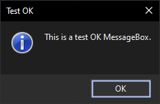

**Figure 1.** Simple **OK** message box.

And here's what a message box with a question-mark icon, and **OK** and **Cancel** buttons looks like:

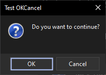

**Figure 2.** Message box with **OK** and **Cancel** buttons and a question-mark icon.

Now, let's see what a message box that has the warning/exclamation-mark icon, and **Yes** and **No** buttons looks like:

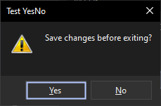

**Figure 3.** Message box with **Yes** and **No** buttons and an exclamation-mark icon.

Now, let's see what we get when we specifiy `MessageBoxIcon.Question` and `MessageBoxButtons.YesNoCancel`:

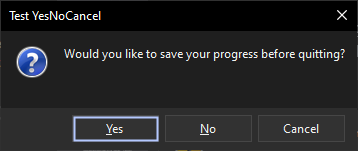

**Figure 4.** Message box with **Yes**, **No**, and **Cancel** buttons and a question-mark icon.

Let's see what we get when we specify `MessageBoxIcon.Stop` and `MessageBoxButtons.RetryCancel`:

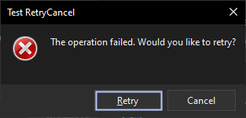

**Figure 5.** Message box with **Retry** and **Cancel** buttons and a stop-sign icon.

Finally, I bet you're really excited to see what a message box with a `MessageBoxIcons.Stop` icon and **Abort**, **Retry**, and **Ignore** buttons looks like:

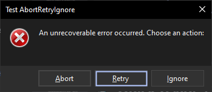

**Figure 6.** Message box with **Abort**, **Retry**, and **Ignore** buttons and a stop-sign icon.

Here's a message box with an information icon and just an **OK** button, but with wider text:

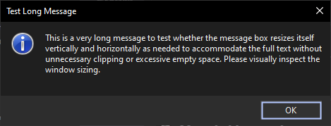

**Figure 7.** Message box with **OK** button and an information icon with wider, longer text.

See how it adjusts its size, just like the message box(es) that come with Windows do?

You're probably wondering what occurs if you specify a message that has very short text.  Well, I'll show you:

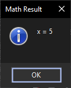

**Figure 8.** Message box with **OK** button and an information icon with very short text.

One nice feature of the default message boxes that ship with all copies of Microsoft Windows is the fact that they will also widen themselves if the caption is very very long, even if the message body text is not.  Our message box does this, too.  Here's an example of a message box with a very long caption, but short body text:

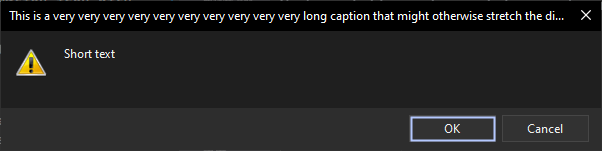

**Figure 9.** Message box with **OK** button and an information icon with very long caption text.

There is a cap on the width of the message box, though.  If the message body text is too long, the message box will be restricted in how wide it can grow.

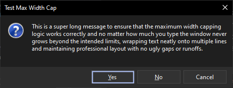

**Figure 10.** Message box with **Yes**, **No**, and **Cancel** buttons, a question-mark icon, and an information icon with very long body text.

You can override this cap by setting the `DarkMessageBoxMetrics.MaximumFormWidth` property.

The message box, just like the version that ships with Windows, also will make itself taller if you have long text in the body of the message box.  Here's an example of a message box with a very long body text, but short caption text:

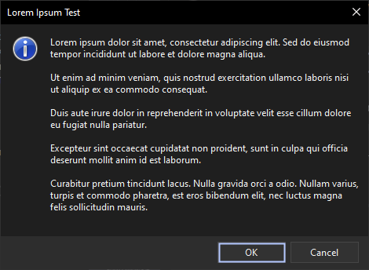

**Figure 11.** Message box with **OK** and **Cancel** buttons and an information icon with very long body text that makes it size itself taller to accommodate.

This is all included out-of-the-box with this code.  My aim was to make a message box that looks and feels exactly the same as those that ship with Windows, but with a dark theme.

---

## 🚀 Quick Usage Example

You can use `DarkMessageBox.Show` to display a message box.  It has the same signature as `System.Windows.Forms.MessageBox.Show`, so you can use it in place of `System.Windows.Forms.MessageBox.Show` without any changes to your code.

```csharp
using xyLOGIX.DarkMessageBox;

// Simple OK dialog
DarkMessageBox.Show("Operation completed successfully.", "Success");

// Yes/No dialog
var result = DarkMessageBox.Show(
    "Would you like to save changes?",
    "Confirm Save",
    MessageBoxButtons.YesNo,
    MessageBoxIcon.Question,
    MessageBoxDefaultButton.Button1
);

if (result == DialogResult.Yes)
{
    // Save logic here
}
```

You can even optionally pass in a reference to any class that implements `IWin32Window`, in the first parameter, to designate the parent window of the message box:

```csharp
using xyLOGIX.DarkMessageBox;

/*...*/

public class MainWindow : Form
{
    public void PromptUser()
    {
        // Simple OK dialog
        DarkMessageBox.Show(this, "Operation completed successfully.", "Success");

        // Yes/No dialog
        var result = DarkMessageBox.Show(
            this,
            "Would you like to save changes?",
            "Confirm Save",
            MessageBoxButtons.YesNo,
            MessageBoxIcon.Question,
            MessageBoxDefaultButton.Button1
        );

        if (result == DialogResult.Yes)
        {
            // Save logic here
        }
    }
}
```

---

**NOTE:** This new message box also changes the style of its titlebar to match the current Windows desktop theme -- a black title bar is used if the theme is `Dark` operating-system wide; or a white title bar is used if the theme is `Light` operating-system wide.  This is done to ensure that the message box is visually consistent with the rest of the Windows UI.  This corrects a deficiency in the original `System.Windows.Forms.MessageBox` class, which does not change the title bar color to match the current Windows theme.

---

## 🎨 Theme Switching Example


You know, the standard Win32 `MessageBox` message boxes really do not leave a whole lot of room for skinning and customizing their look, feel, behavior, and actions.  Well, that ends now -- with this NuGet package, you can skin the ever-living _snot_ out of your message boxes.  You can:

* Set it to automatically close after a certain number of milliseconds; 
* Override the message box body icon that is displayed next to the body with your own custom icon (or display none at all);
* Give the message box _window_ its own corresponding icon and even make it appear in the Taskbar.  This can be useful, say, when you are displaying the message box during app startup but before the main application window has appeared.  This allows users to find your message box in the Z-order or via `ALT+TAB`;
* Customize button text, message content text, titlebar, background, and footer colors; and
* Set the `DarkMessageBoxMetrics.TitleBarIsLight` property to make the titlebar be light or dark;

... and more!

---


**NOTE:** Support is currently not implemented for changing the _shape_ of the message boxes, though.

---

Customization is best done by using `Theme`s.  These are concrete classes that implement the `IDarkMessageBoxTheme` interface.  You can create your own themes by implementing this interface, or you can use the built-in themes.

It is recommended to always create your concrete theme classes as Singletons. 

Example theme classes are shown: 

* `ProfessionalDarkTheme` - sets a professional dark theme style.
* `BartSimpsonTheme` - sets a novelty theme with Bart Simpson colors and button text.
* `CowabungaTheme` - sets a novelty theme with Teenage Mutant Ninja Turtles* colors and button texts that correspond to what Michaelangelo or Raphael might say.

For demonstration purposes, `BartSimpsonTheme`, `CowabungaTheme`, and `ProfessionalDarkTheme` classes are included with this codebase that you can use out-of-the-box.

For example, here is what a message box displayed using the `BartSimpsonTheme` looks like:

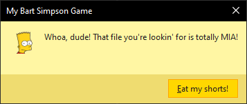

**Figure 12.** Bart Simpson`**`-themed message box.

Here's what a message box, displaying using the colors and styles of the 1987 Teenage Mutant Ninja Turtles`*` cartoon, might look like, with a fun little 'Michelangelo' icon:

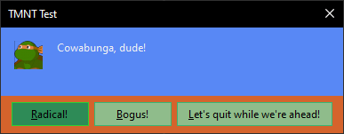

**Figure 13.** Teenage Mutant Ninja Turtles`*`-themed message box.

And, FYI, the **Let's Quit While We're Ahead** is probably more like something that Raphael would say, but I couldn't find a good icon for him.  So, I went with Michelangelo.  The message box is still themed to look like the TMNT cartoon, though.

And, if we revert to the `ProfessionalDarkTheme`, the message box looks like this:

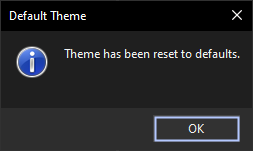

**Figure 14.** Professional dark-themed message box.

The `ProfessionalDarkTheme` is the default.

The code automatically validates the settings of all themes so that we don't use things such as zero widths for buttons or the _x_-coordinate of the right-hand side of a button being less than the _x_-coordinate of the left-hand side of the button.  

This is done to ensure that the message box is always displayed correctly, regardless of the theme you choose.  

If a particular theme has invalid value(s) for its property(ies), it will simply be suppressed, and the `ProfessionalDarkTheme` will be substituted instead.  

Messages will be emitted to the **Debug** output window in Visual Studio telling you what setting is not correct, however.

---
**NOTE:** To ensure elements from previous themes do not carry over to the next, each implementation of the `IDarkMessageBoxTheme.Apply` method MUST start out by calling the `DarkMessageBoxMetrics.Reset` method PRIOR to then customizing the look and feel of the message box.  Calling `DarkMessageBoxMetrics.Reset` resets the dialog style, colors, look, and feel to the default, professional dark theme.

---

```csharp
// Apply a Bart Simpson novelty theme
DarkMessageBoxThemeManager.ApplyTheme(BartSimpsonTheme.Instance);

// Revert to default professional theme later
DarkMessageBoxThemeManager.ApplyTheme(ProfessionalDarkTheme.Instance);
```

The `DarkMessageBoxThemeManager.ApplyTheme` method must always be called prior to `DarkMessageBox.Show` to use the theme you want.

In case you set a theme, display a message box, and then forget to set it back, the message box will reset the theme for you, to the `ProfessionalDarkTheme`, when it is closed.  You can suppress this behavior by setting the `DarkMessageBoxMetrics.SuppressAutoReset` property to `true`.  Setting the `DarkMessageBoxMetrics.SuppressAutoReset` property to `true` causes all the message boxes in your application, from that moment on, to display using the theme you set.

The various themes set the property(ies) of the `DarkMessageBoxMetrics` static class.  

To force the titlebar of the message box to be Light-themed (i.e., white), set `DarkMessageBoxMetrics.TitleBarIsLight` to `true`.  It's `false` by default, which means to display a black titlebar.

---

## 🤝 Contributing

Contributions, bug reports, and feature suggestions are welcome!

Please open a [GitHub Issue](https://github.com/astrohart/xyLOGIX.DarkMessageBox/issues)  
or submit a Pull Request.  No promises or guarantees are made as to whether issues will be addressed, nor whether PRs will be accepted.

You may fork this repo freely.

---

## 📜 License

This project is licensed under the [MIT License](LICENSE).

Copyright © 2025 by xyLOGIX, LLC.  
All rights reserved.

`*` Teenage Mutant Ninja Turtles is a registered trademark of ViacomCBS and remains the property of ViacomCBS.

`**` The Bart Simpson character is a registered trademark of 20th Century Fox and remains the property of 20th Century Fox.